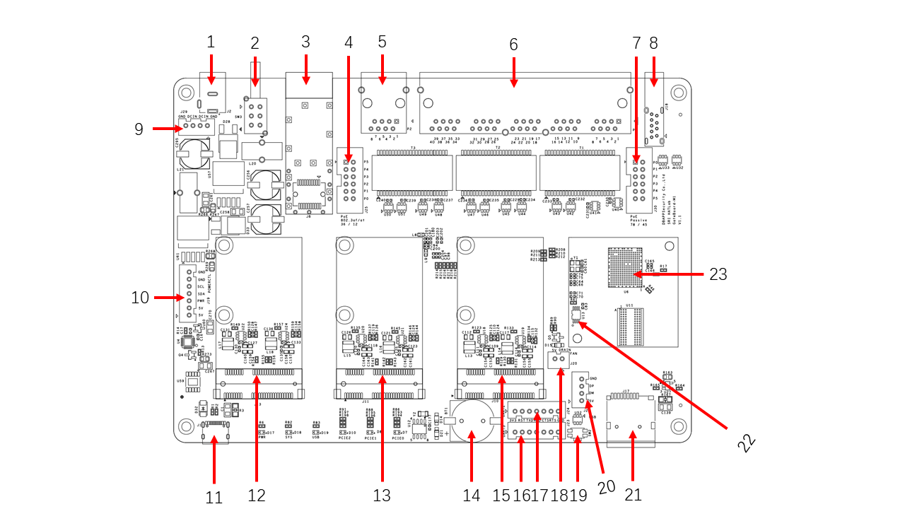
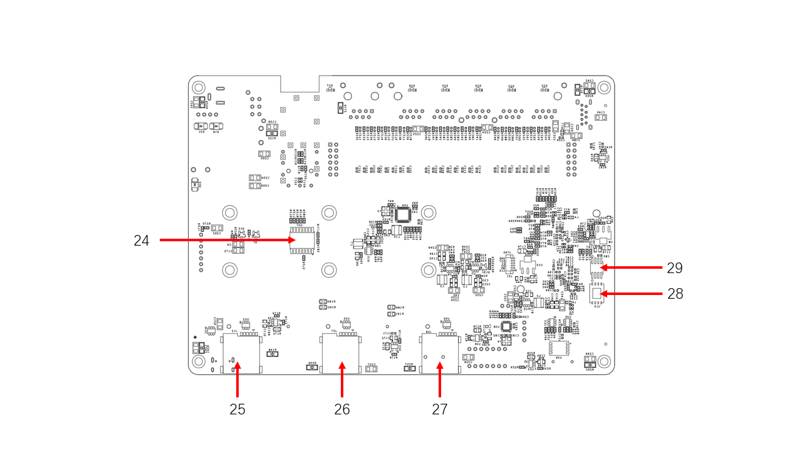

# Hardware function

1. [DC Power]
2. Power Switch
3. [SFP Combo]
4. [PoE IEEE]
5. [RJ45 Combo][SFP Combo]
6. [Ethernet] ports 1-5
7. [PoE Passive]
8. [USB 3.0]
9. External power supply interface
10. Function extension interface
11. Type-C (PD / [Serial])
12. [PCIe2]
13. [PCIe1]
14. RTC Battery (CR1220)
15. [PCIe0]
16. [Full-featured UART] 1
17. [Full-featured UART] 2
18. Fan Power Interface
19. Reset Power
20. Fan Control Interface
21. Pop-up [TF card slot]
22. Temperature Sensor [^temp-sensor]
23. [MT7621AT] Chip
24. GPIO extended chip
25. Pop-up [SIM card slot] 2
26. Pop-up [SIM card slot] 1
27. Pop-up [SIM card slot] 0
28. SPI NAND (Reserved)
29. BIOS NOR [^bios-flash]

[^temp-sensor]: On-board x1 Temperature Sensor, Used to collect the main control temperature.
[^bios-flash]: 512KB SPI Flash

[MT7621AT]: https://deviwiki.com/wiki/MediaTek_MT7621#MT7621AT
[DC Power]: ../schematic/README.md#power
[PoE IEEE]: ../pinout/README.md#poe-ieee
[PoE Passive]: ../pinout/README.md#poe-passive
[SFP Combo]: ../pinout/README.md#sfp
[Ethernet]: ../pinout/README.md#ethernet
[USB 3.0]: ../pinout/README.md#usb-30
[Serial]: ../schematic/README.md#usb-uart
[PCIe0]: ../schematic/README.md#pcie-0-connector
[PCIe1]: ../schematic/README.md#pcie-1-connector
[PCIe2]: ../schematic/README.md#pcie-2-connector
[Full-featured UART]: ../pinout/README.md#uart
[TF card slot]: ../pinout/README.md#tf-slot
[SIM card slot]: ../pinout/README.md#sim-slot
