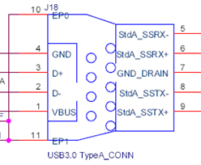

# PINOUT

## UART

> The UART Support RS232 / RS485

|   # | Name     |
| --: | -------- |
|   1 | UART_3V3 |
|   2 | UART_TX  |
|   3 | UART_RX  |
|   4 | UART_CTS |
|   5 | UART_RTS |
|   6 | UART_GND |

## USB 3.0

> On-board x1 USB 3.0 Interface, Compatible USB 2.0, USB 1.1, Support USB-Hub Extending.

|   # | Name       |
| --: | ---------- |
|   1 | VBUS       |
|   2 | USB_D-     |
|   3 | USB_D+     |
|   4 | GND        |
|   5 | StdA_SSRX- |
|   6 | StdA_SSRX+ |
|   7 | GND_DRAIN  |
|   8 | StdA_SSTX- |
|   9 | StdA_SSTX+ |

## JTAG

|   # | Name     |
| --: | -------- |
|   1 | JTAG_CLK |
|   2 | JTAG_MS  |
|   3 | JTAG_DO  |
|   4 | JTAG_DI  |
|   5 | JTAG_RST |
|   6 | GND      |

## PCIe

> There are 3 PCIe interfaces on board, all of which support PCIe2.0 x1 specification, and support PCIe function expansion cards such as PCIe to USB, PCIe to SATA, PCIe wired network card, PCIe wireless network card, etc.
>
> The 3 PCIe interfaces all support the expansion of the 4G/LTE module of the USB bus, and are connected with the onboard pop-up SIM card holder
>
> (Note: due to the BUG of the 7621 itself, only 2 modules can work at the same time when the dedicated module is not used).

|   # | Name (Standard) | Name (On board) |
| --: | --------------- | --------------- |
|   1 | WAKE#           | NC              |
|   2 | 3.3Vaux         | VCC_3V3         |
|   3 | COEX1           | NC              |
|   4 | GND             | GND             |
|   5 | COEX2           | NC              |
|   6 | 1.5V            | VCC_1V5         |
|   7 | CLKREQ#         | NC              |
|   8 | UIM_PWR         | VCC_SIM         |
|   9 | GND             | GND             |
|  10 | UIM_DATA        | SIM_IO          |
|  11 | REFCLK-         | PCIE_CKN        |
|  12 | UIM_CLK         | SIM_CLK         |
|  13 | REFCLK+         | PCIE_CKP        |
|  14 | UIM_RESET       | SIM_RESET       |
|  15 | GND             | GND             |
|  16 | UIM_Vpp         | SIM_VPP         |
|  17 | _Reserved_      | NC              |
|  18 | GND             | GND             |
|  19 | _Reserved_      | NC              |
|  20 | W_DISABLE#      | PU              |
|  21 | GND             | GND             |
|  22 | PERST#          | PCIE_RST        |
|  23 | PERn0           | PCIE_RXP        |
|  24 | 3.3Vaux         | VCC_3V3         |
|  25 | PERp0           | PCIE_RXN        |
|  26 | GND             | GND             |
|  27 | GND             | GND             |
|  28 | 1.5V            | VCC_1.5V        |
|  29 | GND             | GND             |
|  30 | SMB_CLK         | I2C_SCL         |
|  31 | PETn0           | PCIE_TXP        |
|  32 | SMB_DATA        | I2C_SDA         |
|  33 | PETp0           | PCIE_TXN        |
|  34 | GND             | GND             |
|  35 | GND             | GND             |
|  36 | USB_D-          | USB_D-          |
|  37 | GND             | GND             |
|  38 | USB_D+          | USB_D+          |
|  39 | 3.3Vaux         | NC              |
|  40 | GND             | GND             |
|  41 | 3.3Vaux         | NC              |
|  42 | LED_WWAN#       | PCIE_LED0       |
|  43 | GND             | NC              |
|  44 | LED_WLAN#       | PCIE_LED1       |
|  45 | _Reserved_      | NC              |
|  46 | LED_WPAN#       | PCIE_LED2       |
|  47 | _Reserved_      | VCC_5V          |
|  48 | 1.5V            | VCC_1.5V        |
|  49 | _Reserved_      | VCC_5V          |
|  50 | GND             | GND             |
|  51 | _Reserved_      | NC              |
|  52 | 3.3Vaux         | VCC_3V3         |

## SFP

> There is one SFP interface with plug-in detection on board, which is a mutually exclusive interface with RJ45 Combo.
>
> Compatible with ordinary GbE fiber optic modules.

|   # | Name        |
| --: | ----------- |
|   1 | GND         |
|   2 | TX_Fault    |
|   3 | TX_disable  |
|   4 | MOD-DEF2    |
|   5 | MOD-DEF1    |
|   6 | MOD-DEF0    |
|   7 | Rate_Select |
|   8 | Rate_LOS    |
|   9 | GND         |
|  10 | GND         |
|  11 | GND         |
|  12 | EPHY_SIN    |
|  13 | EPHY_SIP    |
|  14 | GND         |
|  15 | SFP_VCC0    |
|  16 | SFP_VCC1    |
|  17 | GND         |
|  18 | EPHY_SOP    |
|  19 | EPHY_SON    |
|  20 | GND         |

## Ethernet

> There are 6x GbE RJ45 network ports on board, all complying with IEEE1588-2008.

|   # | Name       |
| --: | ---------- |
|   1 | TCT        |
|   2 | EPHY_A_P   |
|   3 | EPHY_A_N   |
|   4 | EPHY_B_P   |
|   5 | EPHY_C_P   |
|   6 | EPHY_C_N   |
|   7 | EPHY_B_N   |
|   8 | EPHY_D_P   |
|   9 | EPHY_D_N   |
|  10 | MCT        |
|  11 | LED_YELLOW |
|  12 | GND        |
|  13 | GND        |
|  14 | LED_GREEN  |
|  15 | EPHY_SHELD |
|  16 | EPHY_SHELD |

## TF Slot

|   # | Name     |
| --: | -------- |
|   1 | SDIO_D2  |
|   2 | SDIO_D3  |
|   3 | SDIO_CMD |
|   4 | VCC_3V3  |
|   5 | SDIO_CLK |
|   6 | GND      |
|   7 | SDIO_D0  |
|   8 | SDIO_D1  |
|   9 | SDIO_CD  |
|  10 | EP       |
|  11 | EP       |
|  12 | EP       |
|  13 | EP       |

## SIM Slot

|   # | Name    |
| --: | ------- |
|   1 | SIM_VCC |
|   2 | SIM_IO  |
|   3 | SIM_CLK |
|   4 | SIM_RST |
|   5 | SIM_VPP |
|   6 | GND     |

## Power Control

|   # | Name      |
| --: | --------- |
|   1 | GND       |
|   2 | I2C_SCL   |
|   3 | I2C_SDA   |
|   4 | PWR_CTL   |
|   5 | FAN_DRAIN |
|   6 | VCC       |

\* PWR_CTL: high level is Power ON, low level is Power OFF.

## PoE IEEE

> Standard: 802.3af / 802.3at

## PoE Passive

> Standard: Passive
