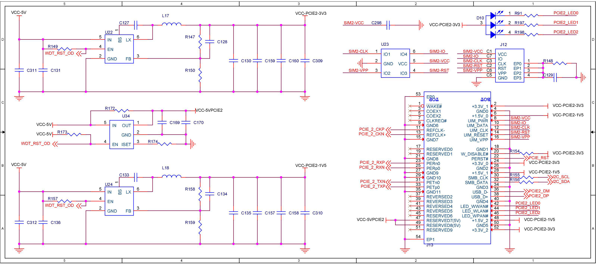

# Schematic diagram

## Power

> On-board x1 DC Power, Support 9-19V DC input.

No Public

## USB UART

> The USB Serial is [CH340N] chip

## SoC Config

## SoC Power

## SoC Memory

## SoC System/USB/PCIe

## SoC GSwitch/RGMII

No Public

## Perhipial

## External PHY

No Public

## USB Hub

## Network (Connector)

No Public

## PCIe 0 (Connector)

> PINOUT: [PCIe]

## PCIe 1 (Connector)

> PINOUT: [PCIe]

## PCIe 2 (Connector)

> PINOUT: [PCIe]

## Misc (Connector)

[CH340N]: https://www.wch-ic.com/products/CH340.html
[PCIe]: ../pinout/README.md#pcie
